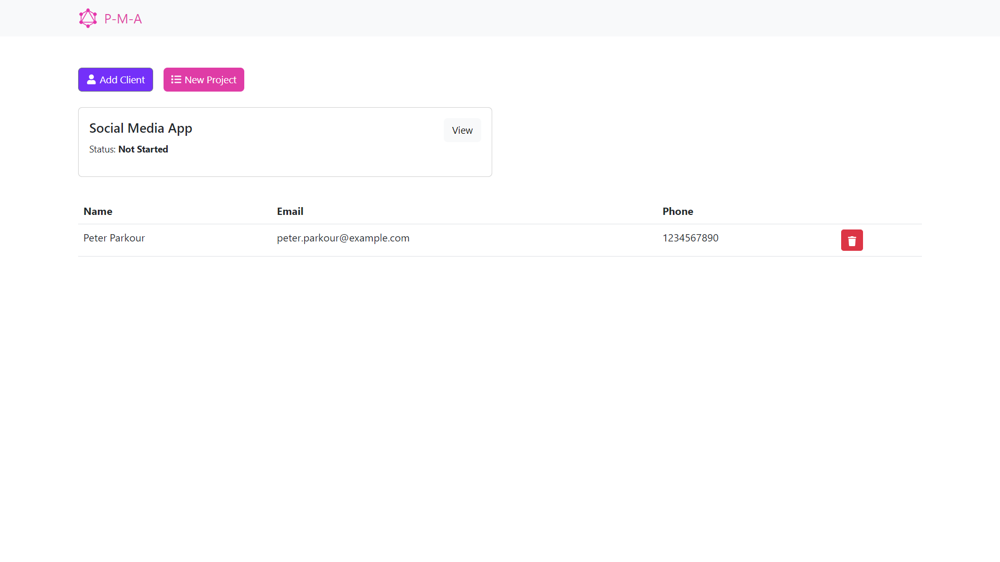
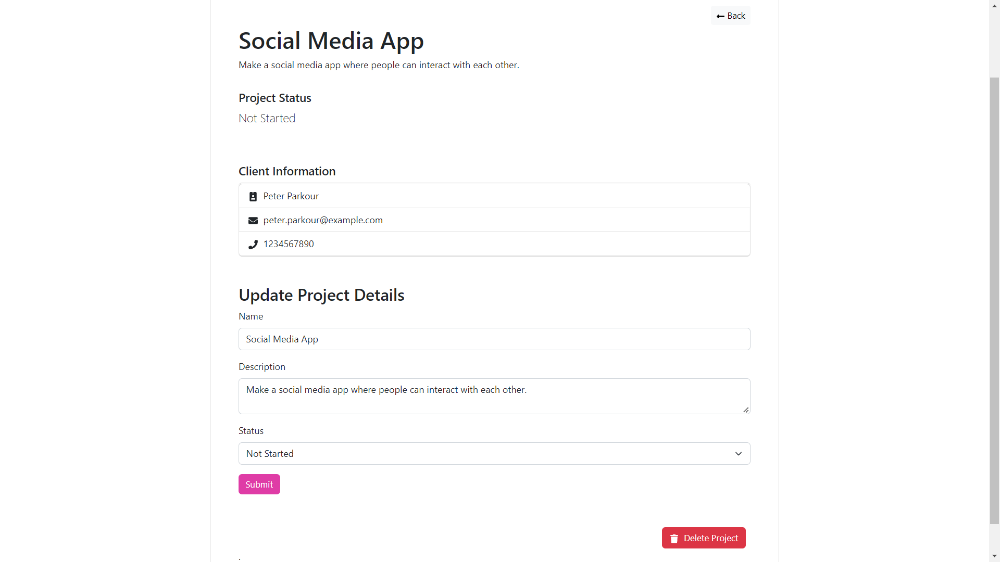

# App Dashboard

# Project Detail

## Project setup
After cloning this app

### Run `npm install` for installing all dependency for root and then. Run `npm install -D` or `npm install --save-dev` for its devDependency

### Run `npm install` for installing all dependency for client directory and then. Run `npm install -D` or `npm install --save-dev` for its devDependency

## Available Scripts
In the project directory, you can run:

### Run `npm start` from the client directory for starting up frontend

Runs the app in the development mode.
Open [http://localhost:3000](http://localhost:3000) to view it in your browser.

### Run `npm start` from the root directory for starting up the server and for DB connection
You have to run `npm start` again and again if any change made for server code

### Run `npm run dev` for hot reloading for server code with the help of nodemon

Open [http://localhost:5000/graphql](http://localhost:5000/graphql) to view CMS for graphql